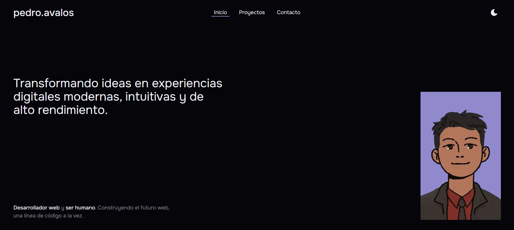

# 💻 Portafolio Personal
Portafolio personal que muestra los proyectos realizados y formulario de contacto.



## ✨ Features
- Listado de proyectos realizados
- Formulario de contacto
- Diseño Responsivo

## 🛠️ Tecnologías
- React
- TypeScript
- Motion
- Tailwind CSS

## 🚀 Instalación
> Este proyecto utiliza Bun como runtime y gestor de paquetes.
```
git clone git@github.com:Over12/portfolio.git
cd portfolio
bun install
bun dev
```

## 🧑‍💻 Autor
- **Pedro Avalos Figueroa**
- Desarrollador Web
- GitHub: https://github.com/Over12